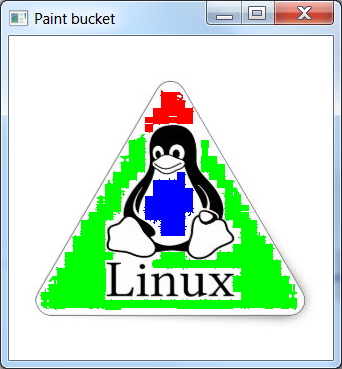

# Paint Bucket (C++)
A paint bucket application that can load up a file, and fill sections of the same color (fill function).

* Original image

* Pass 1 - Fill the middle

* Pass 2 - Fill inside the triangle

* Pass 3 - Fill outside the triangle

* Pass 4 - Fill the feet, and around the letters
